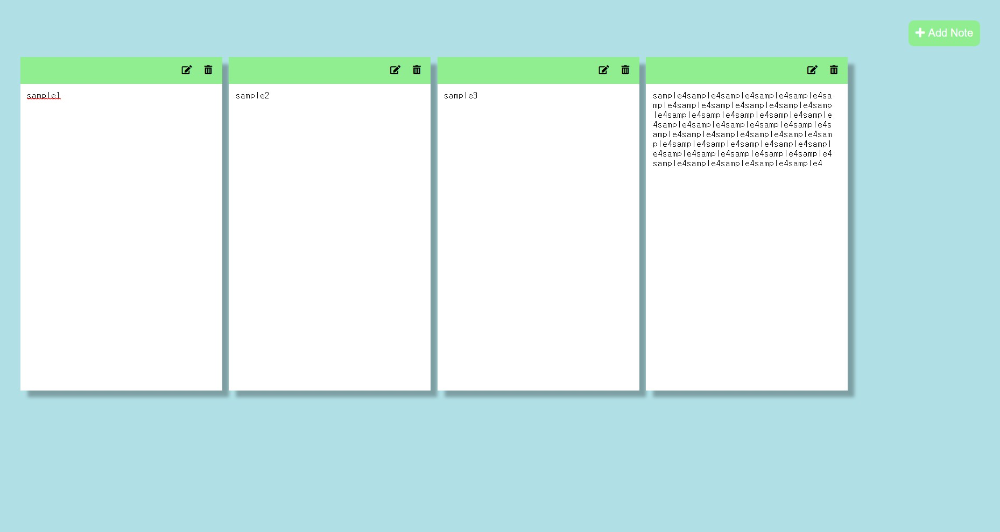
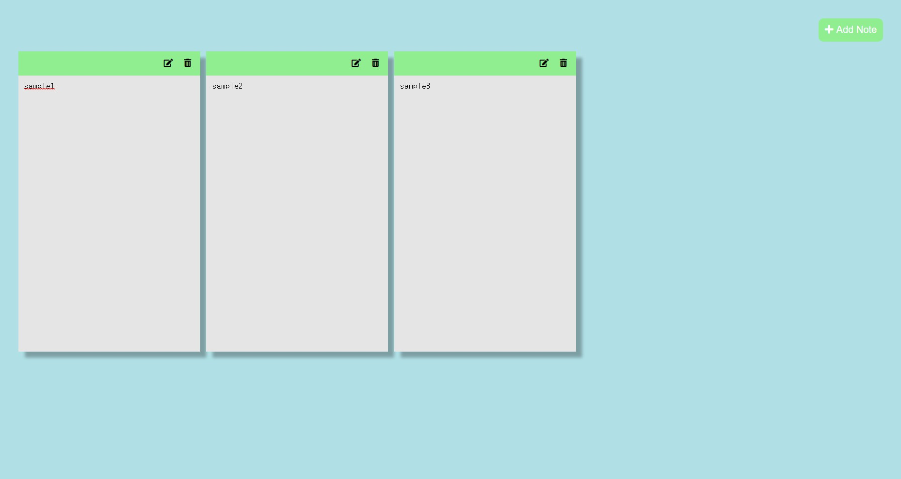

# Memo-App
 
<ol>
  <li><strong>프로젝트 이름</strong> : Memo-App</li>
  <li><strong>사용 언어</strong> : HTML, CSS, Vanila Javascript</li>
  <li><strong>주요 기능</strong> 
    <ul>
      <li><strong>메모 추가: </strong>화면 우측 상단 'Add Note'를 클릭하면 새로운 노트가 추가됩니다.</li>
      <li><strong>메모 변경: </strong>각 메모의 우측 상단 edit 버튼을 클릭하여 수정/읽기전용 모드를 변경할 수 있습니다.</li>
      <li><strong>메모 저장: </strong>각 메모의 내용은 localStorage에 저장되며, 새로고침시 자동으로 로드됩니다.</li>
      <li><strong>메모 삭제: </strong>각 메모의 우측 상단 delete 버튼을 클릭하여 메모를 삭제할 수 있습니다. localStorage에서도 삭제됩니다.</li>
    </ul>
   </li> 
  <li><strong>배운점</strong>: 
    <ul>
    <li> 1. 이전의 프로젝트에서 명확한 문제 정의없이 변수를 정의하고 이벤트를 가져다 붙이다가, 어디서 잘못됐는지 모르는 정도에까지 이르게 됐었었다.</li>
    <li> 2. 이에 반성하며 작업했고, 본 프로젝트 내용 중 사용자 클릭에 따라 메모들을 하나씩 createElement하는 것 같은 경우에는, 해당 함수 내에서 먼저 addEventListener를 개별적으로 붙여서 출고시키는 것 효과적임을 깨닫게 되었다. </li>
    <li> 3. 또한 배열내 프로퍼티 들을 정의할 때 array[0] = '~' 처럼 특정 index의 프로퍼티를 확정시킬 수 있다는 것을 배웠다. </li>
    <li> 4. 배열내 연산시, 펼침연산자는 배열의 모든 프로퍼티들을 최대한 분해한 후 연산해준다. </li>
    </ul>
   </li>
  </ol>

   
   
  <h5> 메인 화면 </h5>
   
  
  <h5> 메모 추가 </h5>
   
  
  <h5> 읽기 전용 모드 및 메모 삭제 </h5>
   
  

     
